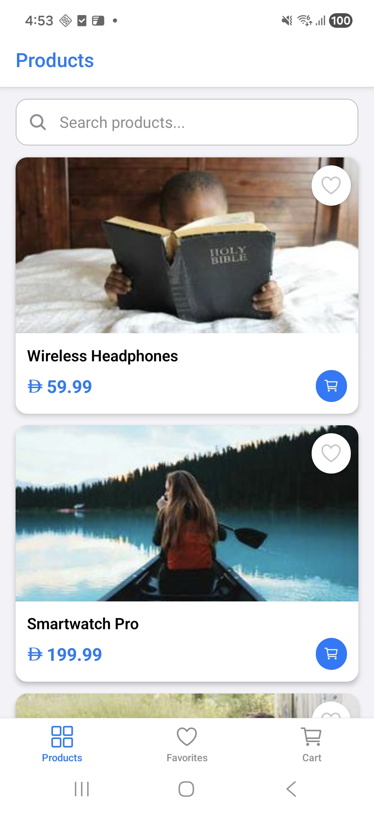
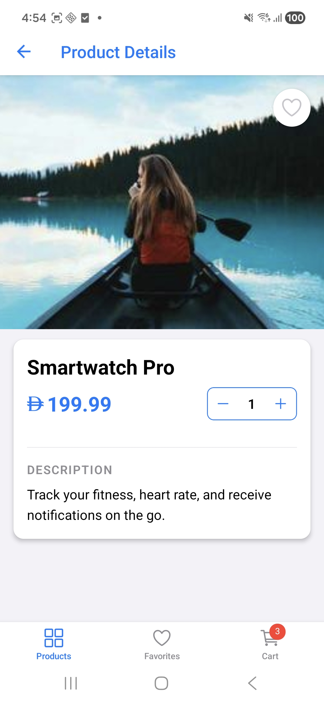
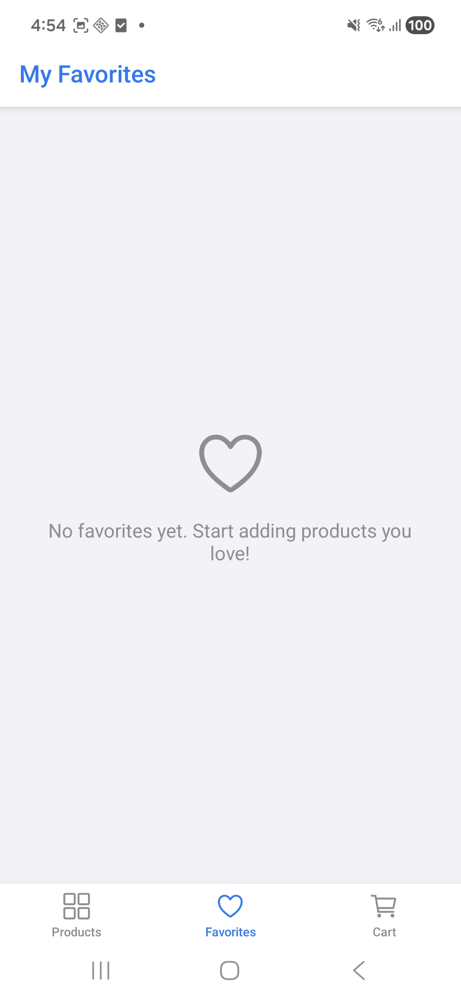
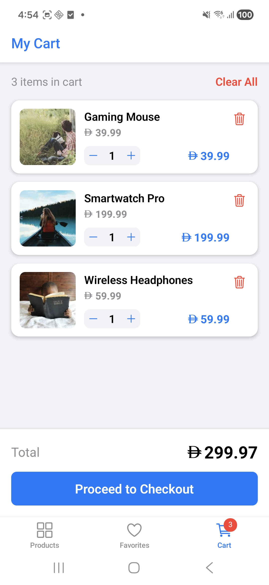

# E-Commerce Mobile App

A cross-platform e-commerce mobile application built with React Native/Expo and TypeScript. This app demonstrates production-ready mobile development practices with clean architecture, state management, and a polished user experience.

## 📱 Screenshots

<p align="center">
  
  
  
  
</p>

| Products | Details | Favorites | Cart |
|----------|---------|-----------|------|
| Product grid with search | Product details with add to cart | Saved favorites | Shopping cart with quantity controls |

## 🚀 Getting Started

### Prerequisites

- Node.js (v18 or higher)
- npm or yarn
- Expo CLI (`npm install -g expo-cli`)
- iOS Simulator (for iOS testing) - macOS only
- Android Studio/Emulator (for Android testing)

### Installation

```bash
# Clone the repository
git clone <repository-url>
cd ecommerce-react-native

# Install dependencies
npm install

# Start the development server
npm start
```

### Running the App

```bash
# Run on iOS Simulator
npm run ios

# Run on Android Emulator
npm run android

# Run on Web
npm run web
```

### Running Tests

```bash
# Run all tests
npm test

# Run tests in watch mode
npm run test:watch

# Run tests with coverage report
npm run test:coverage
```

## ✨ Features Implemented

### Core Features

- ✅ **List Screen**: Product grid with images, names, and prices
- ✅ **Search**: Client-side filtering by product name
- ✅ **Details Screen**: Full product info with favorite toggle and add to cart
- ✅ **Favorites Screen**: View and manage favorite products
- ✅ **Cart Screen**: Full shopping cart with quantity controls
- ✅ **Persistence**: Favorites and cart persist across app restarts
- ✅ **Pull-to-Refresh**: Refresh product list
- ✅ **Loading States**: Visual feedback during data fetching
- ✅ **Error States**: Graceful error handling with retry option
- ✅ **Empty States**: Friendly messages when lists are empty

### Navigation & Deep Links

- ✅ Tab-based navigation with React Navigation
- ✅ Deep linking support:
  - Web: `/product/:id`
  - Native: `myshoplite://product/:id`
- ✅ Nested stack navigators for each tab

### Cross-Platform UX

- ✅ Single codebase for iOS, Android, and Web
- ✅ Responsive layout: 2 columns on tablet/web, 1 column on mobile
- ✅ Platform-consistent styling

### Accessibility

- ✅ Semantic accessibility labels on all interactive elements
- ✅ Screen reader compatible
- ✅ Proper button roles and states

### Bonus Features

- ✅ Shopping cart with full CRUD operations
- ✅ Pull-to-refresh on product list
- ✅ Error handling for API failures
- ✅ Performance optimizations (memoization with `useCallback`, `useMemo`)
- ✅ 101 unit tests with Jest + React Native Testing Library

## 🏗️ Technical Decisions & Architecture

### State Management: Redux Toolkit

**Rationale**: Redux Toolkit was chosen for:
- Predictable state updates with immutable patterns
- Built-in dev tools for debugging
- Excellent TypeScript support
- Async operations with `createAsyncThunk`
- Automatic persistence middleware integration

**Structure**:
```
store/
├── index.ts          # Store configuration & exports
├── hooks.ts          # Typed useDispatch/useSelector hooks
└── slices/
    ├── productsSlice.ts   # Product catalog state
    ├── favoritesSlice.ts  # User favorites state
    └── cartSlice.ts       # Shopping cart state
```

### Component Architecture

**Pattern**: Presentational + Container separation
- **Presentational components** (`components/`): UI-only, receive props
- **Screen components** (`screens/`): Connect to Redux, handle business logic

**Key Components**:
- `ProductCard` - Reusable product display with favorite/cart actions
- `ProductGrid` - Responsive grid layout with pull-to-refresh
- `FavoriteButton` - Heart toggle with animations
- `AddToCartButton` - Add button or quantity controls
- `Price` - Formatted price with Dirham icon

### Data Persistence Strategy

**Solution**: AsyncStorage with Redux middleware

**How it works**:
1. On app start, `loadFavorites()` and `loadCart()` hydrate state from AsyncStorage
2. Redux store subscribers watch for state changes
3. Changes auto-save to AsyncStorage (debounced)
4. Works on iOS, Android, and Web (via localStorage polyfill)

### Performance Considerations

1. **Memoization**: `useMemo` for filtered/computed lists, `useCallback` for handlers
2. **Component optimization**: Extracted pure components to prevent unnecessary re-renders
3. **Lazy evaluation**: Products filtered only when search query changes
4. **FlatList**: Virtualized list for large product catalogs
5. **Image caching**: React Native's built-in image caching

### Security Considerations

1. **No sensitive data**: App doesn't handle passwords or payment info
2. **Input sanitization**: Search queries sanitized before use
3. **Type safety**: TypeScript prevents common vulnerabilities
4. **AsyncStorage**: Used for non-sensitive preferences only

### Testing Strategy

**Approach**: Unit + Integration testing with Jest + React Native Testing Library

**Coverage**:
- Redux slices: Reducers, selectors, async thunks (93% coverage)
- Components: Render, interactions, accessibility (100% for tested components)
- Total: 101 tests, all passing

**Test Structure**:
```
__tests__/
├── store/
│   ├── cartSlice.test.ts       # Cart Redux tests
│   ├── favoritesSlice.test.ts  # Favorites Redux tests
│   └── productsSlice.test.ts   # Products Redux tests
├── components/
│   ├── ProductCard.test.tsx    # Product card tests
│   ├── FavoriteButton.test.tsx # Favorite button tests
│   ├── AddToCartButton.test.tsx # Add to cart tests
│   └── Price.test.tsx          # Price component tests
└── utils/
    └── testUtils.tsx           # Test utilities & helpers
```

## 📁 Project Structure

```
ecommerce-react-native/
├── App.tsx                    # Root component with providers
├── src/
│   ├── components/            # Reusable UI components
│   │   ├── ProductCard.tsx
│   │   ├── ProductGrid.tsx
│   │   ├── FavoriteButton.tsx
│   │   ├── AddToCartButton.tsx
│   │   ├── CartItemCard.tsx
│   │   ├── SearchBar.tsx
│   │   ├── Price.tsx
│   │   ├── DirhamIcon.tsx
│   │   ├── LoadingState.tsx
│   │   ├── ErrorState.tsx
│   │   └── EmptyState.tsx
│   ├── screens/               # Screen components
│   │   ├── ListScreen.tsx
│   │   ├── DetailsScreen.tsx
│   │   ├── FavoritesScreen.tsx
│   │   └── CartScreen.tsx
│   ├── navigation/            # Navigation setup
│   │   ├── RootNavigator.tsx
│   │   ├── TabNavigator.tsx
│   │   ├── ProductsStackNavigator.tsx
│   │   ├── FavoritesStackNavigator.tsx
│   │   ├── CartStackNavigator.tsx
│   │   └── linking.ts         # Deep link config
│   ├── store/                 # Redux state management
│   │   ├── index.ts
│   │   ├── hooks.ts
│   │   └── slices/
│   ├── services/              # API & storage services
│   ├── hooks/                 # Custom React hooks
│   ├── constants/             # Theme, API config
│   ├── types/                 # TypeScript types
│   └── __tests__/             # Unit tests
├── jest.config.js             # Jest configuration
├── jest.setup.js              # Test setup & mocks
└── package.json
```

## 🛠️ Tech Stack

| Category | Technology |
|----------|------------|
| Framework | React Native with Expo |
| Language | TypeScript |
| Navigation | React Navigation v7 |
| State Management | Redux Toolkit |
| Storage | AsyncStorage |
| Testing | Jest + @testing-library/react-native |
| Styling | React Native StyleSheet |

## 📊 Test Results

```
Test Suites: 7 passed, 7 total
Tests:       101 passed, 101 total
Snapshots:   0 total
Time:        ~3s
```

## 🔗 Deep Linking

### Web
- Home: `http://localhost:8081/`
- Product Details: `http://localhost:8081/product/1`
- Favorites: `http://localhost:8081/favorites`
- Cart: `http://localhost:8081/cart`

### Native (iOS/Android)
- Product Details: `myshoplite://product/1`
- Favorites: `myshoplite://favorites`
- Cart: `myshoplite://cart`

### Testing Deep Links

```bash
# iOS Simulator
npx uri-scheme open "myshoplite://product/1" --ios

# Android Emulator
adb shell am start -W -a android.intent.action.VIEW -d "myshoplite://product/1"
```

## 📝 API

The app uses a mock API endpoint:

```typescript
const API_URL = 'https://mocki.io/v1/c53fb45e-5085-487a-afac-0295f62fb86e';
```

Alternatively, products are loaded from local JSON data for offline development.

## 🎨 Design System

### Colors
- Primary: `#007AFF` (iOS Blue)
- Background: `#F5F5F5`
- Surface: `#FFFFFF`
- Text Primary: `#1C1C1E`
- Text Secondary: `#8E8E93`
- Error: `#FF3B30`
- Favorite: `#FF3B30`

### Layout Breakpoints
- Mobile: `< 768px` (single column)
- Tablet/Desktop: `≥ 768px` (two columns)

## 📄 License

This project is for interview/assessment purposes.

---

Built with ❤️ using React Native + Expo

